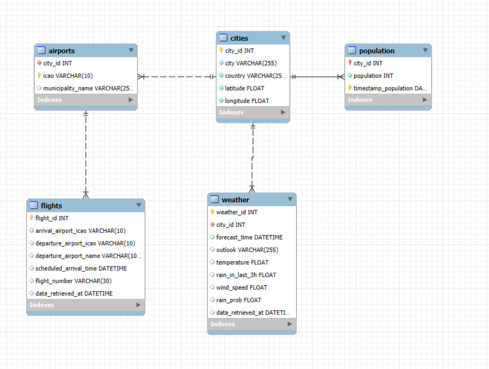
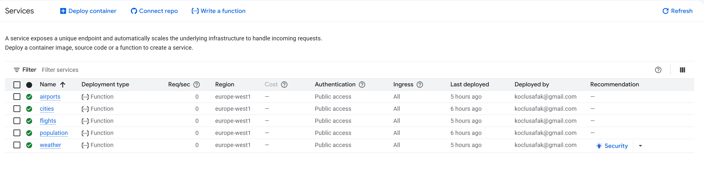
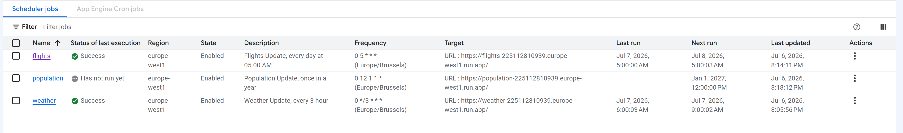

# Automated Cloud Data Pipeline for E-Scooter Demand Prediction — Gans Case Study

## 🎯 Project Overview

Gans, an e-scooter-sharing startup, struggles to keep scooters distributed where users actually need them, since usage patterns shift with weather, tourist inflows, and time of day. This project builds a fully automated data pipeline that collects city, population, weather, and flight data from public sources and APIs, then stores it in a cloud SQL database on a recurring schedule. The result is a serverless, self-updating data foundation that Gans' team can query at any time to eventually power scooter-demand predictions, without anyone needing to run scripts manually.

---

## 📊 Dataset & Sources

- **Cities:** Istanbul and Antalya, Turkey
- **City metadata (coordinates, country):** scraped from [Wikipedia](https://www.wikipedia.org/)
- **Population data:** scraped from [Wikipedia](https://www.wikipedia.org/) infoboxes
- **Weather forecasts:** [OpenWeatherMap API](https://openweathermap.org/) — 5-day / 3-hour forecast data (temperature, rain probability, wind speed, outlook)
- **Airports & flights:** [AeroDataBox API (via RapidAPI)](https://rapidapi.com/aedbx-aedbx/api/aerodatabox) — nearby airports and next-day scheduled arrivals
- **Storage:** Google Cloud SQL (MySQL 8.0), 5 relational tables (`cities`, `population`, `weather`, `airports`, `flights`)
- **Notes:** weather and flight data are volatile by nature and re-collected on a recurring schedule rather than stored as a static snapshot; population is collected annually since it changes slowly

---

## 🚀 Key Findings & Results

This project's deliverable is the pipeline itself rather than an analytical model, so the key results are architectural and operational:

- Migrated a fully working local pipeline (Python + MySQL Workbench) into **5 independent, serverless Cloud Run Functions** — one per data table — with zero shared server infrastructure to maintain
- Automated recurring data collection via **Cloud Scheduler**, replacing manual script execution entirely:
  - Weather refreshed every 3 hours
  - Flights refreshed daily at 05:00
  - Population refreshed yearly on Jan 1st at 12:00
- Designed a normalized relational schema connecting all 5 tables back to `cities`, enabling joined queries across population, weather, and flight data per city
- **Business impact:** the pipeline now gives Gans continuously updated, queryable data on the exact factors called out in the business case (weather-driven usage drops, tourist inflows via flights) without any manual intervention

---

## 🛠️ Technologies Used

**Programming:**
Python, SQL

**Libraries:**
pandas, SQLAlchemy, PyMySQL, requests, BeautifulSoup, lat-lon-parser, pytz

**Cloud Infrastructure:**
Google Cloud SQL (MySQL 8.0), Google Cloud Run Functions (Gen2, Python 3.12), Google Cloud Scheduler

**APIs:**
OpenWeatherMap API, AeroDataBox API (RapidAPI)

**Environment:**
MySQL Workbench (local development), Google Cloud Platform Console

---

## 📁 Project Structure

```
├── README.md
├── cities-function/
│   ├── main.py              # Scrapes & loads city coordinates/country
│   ├── keys.py              
│   └── requirements.txt
├── population-function/
│   ├── main.py              # Scrapes & loads population data
│   ├── keys.py
│   └── requirements.txt
├── weather-function/
│   ├── main.py              # Fetches & loads weather forecasts
│   ├── keys.py
│   └── requirements.txt
├── airports-function/
│   ├── main.py              # Fetches & loads nearby airports
│   ├── keys.py
│   └── requirements.txt
├── flights-function/
│   ├── main.py              # Fetches & loads next-day flight arrivals
│   ├── keys.py
│   └── requirements.txt
└── sql/
    └── create_tables.sql    # Full database schema (DDL)
```

---


## 📈 Visualisations
 
## 1- Database Entity-Relationship Diagram

Entity-relationship diagram of the `gans_local` schema (generated in MySQL Workbench), showing the 5 tables and how `population`, `weather`, and `airports` all connect back to `cities` via foreign keys, with `flights` connected through `airports`.

## 2- Deployed Cloud Run Functions

All 5 data-collection functions deployed and active on Google Cloud Run, each running independently in the `europe-west1` region.

## 3- Cloud Scheduler Jobs

Cloud Scheduler jobs automating the pipeline: weather refreshes every 3 hours, flights update daily at 05:00, and population updates once a year — each triggering its corresponding Cloud Function's HTTPS endpoint on schedule, with no manual intervention.


## 🖼️ Pipeline Architecture

```
                     ┌─────────────────────┐
                     │   Cloud Scheduler   │
                     │  (cron triggers)    │
                     └──────────┬──────────┘
                                │ HTTP trigger
                                ▼
      ┌─────────────────────────────────────────────────┐
      │              Google Cloud Run Functions         │
      │                                                 │
      │   cities-function   population-function         │
      │   weather-function  airports-function           │
      │   flights-function                              │
      └───────────────────────┬─────────────────────────┘
                                │ SQLAlchemy / PyMySQL
                                ▼
                     ┌─────────────────────┐
                     │  Google Cloud SQL    │
                     │  (MySQL 8.0)         │
                     │  Database: gans_local│
                     └─────────────────────┘
```
*Each table is served by its own independently deployable and schedulable Cloud Function, all writing back to the shared `gans_local` MySQL instance. This mirrors how a real data team splits ownership across data sources.*


## 🔗 How to Use This Project
 
1. **Database setup:** Create a Google Cloud SQL (MySQL 8.0) instance from the GCP Console. Once it's running, connect to it from your local machine using MySQL Workbench: create a new connection, enter the instance's public IP as the hostname, keep `root` as the username, and use the password you set during instance creation. Through that connection, open and run `sql/create_tables.sql`. This creates the `gans_local` database and all 5 tables (`cities`, `population`, `weather`, `airports`, `flights`) with their relationships already in place.

2. **Create the Cloud Run Functions**
 
In the GCP Console search bar, search for **Cloud Run Functions** and open it. You'll repeat this process 5 times, once per table:
 
- Click **Deploy container**
- Select the **Functions** option
- Give it a name matching its table (e.g., `cities-function`)
- Choose your region and the Python runtime
- Click **Create**
- Paste that table's function code into the `main.py` section of the inline code editor
- Set **Entry point** to `main` — this has to match the function name defined in your code (`def main(request):`)
- Switch to the `requirements.txt` tab in the same editor and paste in that function's dependencies (see each function's `requirements.txt` in this repo)

Repeat for `cities-function`, `population-function`, `weather-function`, `airports-function`, and `flights-function`.

3. **Credentials:** Before writing any keys, sign up for the two APIs the pipeline depends on:
 
- [OpenWeatherMap](https://openweathermap.org/api) — create a free account and generate an API key. This is needed for `weather-function`.
- [AeroDataBox on RapidAPI](https://rapidapi.com/aedbx-aedbx/api/aerodatabox) — create a RapidAPI account, subscribe to AeroDataBox's free tier, and copy your RapidAPI key. This is needed for `airports-function` and `flights-function`.
Then, in each function folder, create a `keys.py` file with:
 
```python
MySQL_pass = "your-cloud-sql-password"
OW_API_key = "your-openweathermap-api-key"      # weather-function only
AeroDatabox = "your-rapidapi-aerodatabox-key"    # airports & flights functions only
```


**4. Schedule**
 
Create Cloud Scheduler jobs pointing to each function's HTTPS trigger URL using the cron expressions below.
 
| Job | Frequency | Cron expression |
|---|---|---|
| `weather-function` | Every 3 hours | `0 */3 * * *` |
| `flights-function` | Daily at 05:00 | `0 5 * * *` |
| `population-function` | Yearly, Jan 1st at 12:00 | `0 12 1 1 *` |
 
`cities-function` and `airports-function` are triggered manually/on-demand since city and airport lists rarely change.
 
 
---


## 🐛 Production Issues Resolved
 
- **`libsqlite3.so.0` missing:** `pandas.to_sql()` imports Python's `sqlite3` module internally even when the target database is MySQL. The Cloud Functions Python runtime image lacks this system library, causing an `ImportError`. **Fix:** installed `pysqlite3-binary` and aliased it as `sqlite3` before importing `pandas`.

---
 
## 🚀 Future Work
 
- Move credentials to **Google Secret Manager** instead of local `keys.py` files
- Feed the collected data into a predictive model for scooter demand and rebalancing

---
 
## 📧 Contact
 
- Email: koclusafak@gmail.com
- LinkedIn: [My LinkedIn Profile](https://www.linkedin.com/in/safak-koclu/)
- GitHub: [My GitHub Profile](https://github.com/quasar8)
